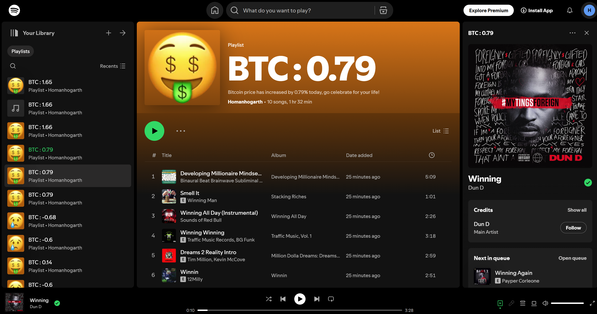

<h4 align="center">Spotify playlist generator based on Bitcoin fluctuations.</h4>


<p align="center">
  <a href="#Description">Description</a> •
  <a href="#APIs Used ">APIs</a> •
  <a href="#Preperations (2 Steps)">Preperation</a> •
  <a href="#How this code works">How this code works</a> •
  <a href="#Credits">Credits</a> •
  <a href="#Note and More">Note and More</a>
</p>

### Description

A simple python tool that allows you to generate a list ( Max. 10 songs) based on the price changes of bitcoin based on the presvious 24 hours.



### APIs Used 

Spotify API : https://developer.spotify.com/documentation/web-api

CoinLore API : https://www.coinlore.com/cryptocurrency-data-api


### Preperations (2 Steps)


**1- Get the spotify API tokens** 

Please have your [SpotifyDeveloper Account](https://developer.spotify.com/documentation/web-api) ready, from the account you should have 4 main data (username/client_id/client_secret/redirect) for your to put this JSON file* template which looks like this:

```bash
{
    "username": "46iweofuwefjnefiwrefwdfwdfwrgq", 
    "client_id": "6e2346824f9573652153g182376535",
    "client_secret": "41`628234058h3567f34cb1237djff45",
    "redirect": "http://google.com"
}
```

> **Note***
> the above its just an example, replace the values inside but **keep the key names untouched** in this dictionary for conveniency later on in the code.


**2- Install libraries** 

Please install **jupyter** and **spotipy**  in your python library as they are not by default.


## How this code work

This Python code generates a Spotify playlist based on the 24-hour price change of Bitcoin, using the CoinLore API to track BTC's movement. If Bitcoin's price goes up, the script collects 400 songs from Spotify, filters out and pick 10 of them based on customizable audio features (such as energy, tempo, etc.), and assigns a user-specified emoji image as the playlist cover.

#### Features

- **Customizable Filters**: Modify audio feature thresholds (e.g., tempo, danceability) to customize the playlist to your taste.

- **Flexible Cover Image**: Swap the playlist cover emoji image to any URL you like.

  

#### Setup

1. Clone this repository.
2. Install required packages (e.g., `spotipy`, `base64`, `requests`).
3. Authentication with Spotify with your `client_id`, `client_secret`, and `redirect_uri` mentioned in the Preperations section.
4. Adjust **Search Parameters*, Audio Features parameters, No. of songs in playlist and Cover Image** as desired.

> **Note***
> When adjusting search parameters, sometimes the SpotifyAPI might return a message of "BAD REQUEST", just keep refreshing until it prints out something successfully. 


## Credits

This software uses the following open source packages:

- [Spotify API](https://developer.spotify.com/documentation/web-api)
- [CoinLore](https://www.coinlore.com/cryptocurrency-data-api)
- Emojis are taken from [here](https://emoji.aranja.com/)

## Note and More

---

Special thanks to everyone who helped me throughout the Creative Tech Apprenticeship 2024

GitHub [https://github.com/homancheung980]&nbsp;&middot;&nbsp;

